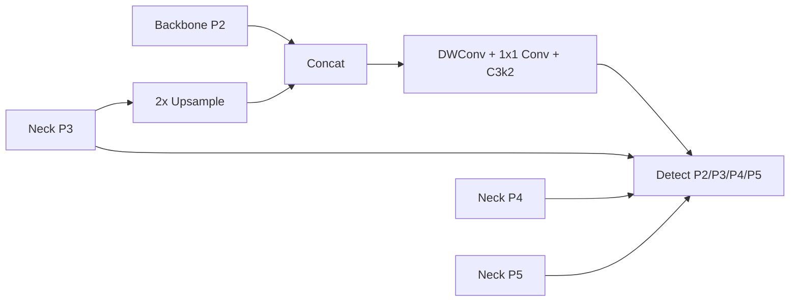

# 技术设计与实现边界

## 研究定位

v1 提供可靠性/跨域研究的可复现实验底座，以及可检验的候选方法。
P2、多尺度、困难负样本、光照增强和温度校准都存在既有研究；组合后不能直接宣称新颖或
保证 SCI 二区录用。要在错误分析和严格对照后凝练方法贡献。

前期讨论中的 DG-HRF、BHNRL 等名称不作为已实现算法名：尚无证据说明这些实现学到了域不变特征。
当前代码没有无监督域适应、对抗域对齐、教师蒸馏、动态图片重采样或视频时序模块。

## 模型与消融

| method | 结构 | 背景附加损失 | 源域光照增强 |
|---|---|---|---|
| baseline | YOLO11n P3/P4/P5 | 0 | 关闭 |
| p2 | YOLO11n P2/P3/P4/P5 | 0 | 关闭 |
| background | YOLO11n P3/P4/P5 | 0.25 | 关闭 |
| p2_background | YOLO11n P2/P3/P4/P5 | 0.25 | 关闭 |
| full | YOLO11n P2/P3/P4/P5 | 0.25 | 开启 |

P2 图在 `configs/models/yolo11n-p2.yaml` 中定义，使用上游已有算子，无需修改 site-packages。
保持原网络 0–22 层的结构和编号。从 neck P3（16 层）上采样，与 backbone P2（2 层）拼接，
经过 DWConv、1×1 Conv 和 C3k2，添加 stride=4 检测输入。原 P3/P4/P5 路径保留。



预训练只迁移语义对应的 0–22 层；所有方法的 Detect head 均随机初始化。
不把相同形状但语义不同的层强行匹配；实际迁移键保存在 `weight_transfer.json`。
这样 baseline 和 P2 使用相同共享层初始化政策。它与历史的完整 `.pt` 微调基线不同，必须重跑。

## 训练期困难背景损失

实现：`firesmoke/models.py::background_penalty`、`BackgroundLoss`。
这是在线困难位置损失，不是最初提议的离线困难图像采样；选择它便于固定样本数和训练步数。

设分类 logits 为 z，形状 [B,C,A]；E 是经过 mosaic/crop 等增强后无 GT 的图像集合。
对每张空图的每个类别，选择 logits 最大的 K 个位置（K 默认 32，不足时取 A）。

```text
L_bg = mean_{i in E, c, a in TopK(z[i,c,:])} softplus(z[i,c,a])
L_total = L_YOLO + alpha * L_bg
```

`softplus(z)` 等价于目标为 0 的 BCE。alpha 默认 0.25；没有空图时附加项为可微零。
每个类别使用相同位置预算，不使用目标域数据，也不使用验证集/测试集选择困难负样本。
为了兼容上游三项损失日志，附加项合并进 cls_loss，保留上游 batch scaling。
不更改 box_loss 或 DFL。不应将本方法的 cls_loss 与原始 cls_loss 当作同一量解释。

局限：mosaic 会减少空图，裁剪也可能产生空图。每轮记录 `background_exposure.jsonl`，
必须查看有效训练暴露量，不能只根据原始背景图片数推断损失生效频率。
重复惩罚负样本可能降低 smoke recall；必须在固定误报预算、固定召回率等口径分析，不能只报精度。
背景并不是 YOLO 的第三个检测类别，names 始终仅包含 fire/smoke。

## 源域光照扰动

实现：`style_augment`，在普通训练增强之后，以 0.5 概率应用逐图 gamma=[0.7,1.5]、
contrast=[0.7,1.3]；扰动分支以 0.1 概率转灰度。图像裁剪到 [0,1]，不改变几何或框坐标。
使用 PyTorch RNG 跟随 seed。它是 source-only 数据增强对照，不是 UDA 或域不变表示证明。
下一轮实验若要更强的域泛化主张，需要加入独立域分组、专门的目标函数及对应基线。

## 图像级可靠性

目标是“该图像是否出现某一类别”，不要求框位置正确。每类分数取该图所有预测框置信度最大值；
没有框记为 0。GT 存在该类任意框记为 1。计算按类图像级 ECE、Brier、召回和负图报警比例。
这些不等于 box-level precision/recall，也不等于检测器的定位校准。

温度缩放：sigmoid(logit(clamp(s,1e-6,1-1e-6))/T)。在源域 val 上搜索
T∈[0.1,10] 的 401 个等对数间隔候选，以 BCE 最小为准。
随后只在该 val 上选择阈值：在经验 FPR≤预算的阈值中最大化 recall；并列优先更低 FPR、更高阈值。
按 `score >= threshold` 报警；若任意非空报警集合都超预算，选择 >1 阈值表示不报警。
重复分数必须整体处理，不能拆散 tie 来制造满足约束的结果。

校准文件绑定 checkpoint SHA256、类别顺序及推理设置。test 报告使用冻结阈值。
由于 T 单调且每模型重新选阈值，温度缩放本身不提高排序或 AP，也不能保证提高最优 recall/FPR；
其作用通过 held-out ECE/Brier 检验。报告中的 val 校准诊断是拟合样本结果，不能当成泛化收益。
1% 是每类负图经验预算，既不是所有背景的联合 1%，也不是每小时误报；跨域不保证该预算成立。

不提供形式化风险保证。默认 image bootstrap 不能消除相邻帧相关性；有完整人工 scene group
时才用 group bootstrap。只出现部分 group 时拒绝计算。零观测误报的非参数区间不能解释为零风险。

## 文件职责

| 文件 | 职责 |
|---|---|
| data.py | 源数据检查、canonical 数据、清单、SHA256/dHash 候选 |
| models.py | P2 图适配、共享初始化、训练附加损失、源域增强 |
| experiment.py | 参数预览、显式训练开关、运行元数据、CPU 模型检查 |
| evaluation.py | 同域/跨域冻结评估、逐图预测、速度、种子汇总 |
| reliability.py | 图像级校准、验证阈值、测试可靠性、bootstrap |
| cli.py | 统一 CLI 参数及命令分发 |

## 上游及许可证

YOLO11 图和检测器接口来源于 Ultralytics 8.4.42，其上游声明 AGPL-3.0：
[Ultralytics repository](https://github.com/ultralytics/ultralytics)，
[YOLO11 documentation](https://docs.ultralytics.com/models/yolo11/)。
派生 YAML 已保留来源和许可说明。本框架不另行改变原仓库或依赖的许可证。
